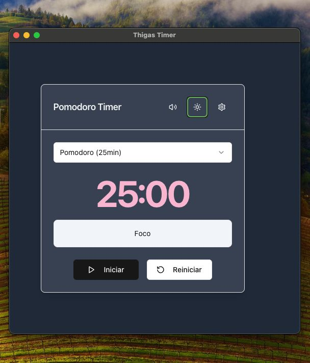

# ThigasTimer 🐱⏰



Um aplicativo Pomodoro Timer elegante e minimalista, desenvolvido especialmente para melhorar a produtividade com um toque pessoal. Apresentando um adorável gatinho siamês como mascote, o ThigasTimer combina funcionalidade com design intuitivo.

## ✨ Funcionalidades

- 🎯 Múltiplos timers personalizáveis
- 🎨 Temas claro e escuro personalizáveis
- 🔊 Notificações sonoras
- 📱 Interface minimalista e amigável
- 🔄 Controles intuitivos (Iniciar, Pausar, Reiniciar)
- 🎯 Rastreamento de atividades por timer

## 🛠️ Tecnologias Utilizadas

- **Framework Principal**: React com TypeScript
- **Estilização**: Tailwind CSS
- **Componentes UI**: shadcn/ui
- **Electron**: Para aplicativo desktop
- **Ícones**: Lucide React
- **Build**: Vite
- **Empacotamento**: Electron Builder

## 🚀 Como Executar Localmente

```bash
# Clone o repositório
git clone [url-do-repositório]

# Entre no diretório
cd thigas-timer

# Instale as dependências
npm install

# Execute em modo desenvolvimento
npm run dev

# Para criar o build de produção
npm run build
```

## 💻 Instalação

### macOS

1. Baixe o arquivo .dmg mais recente da seção de releases
2. Abra o arquivo .dmg
3. Arraste o ThigasTimer para a pasta Applications
4. Pronto para usar! 🎉

## 🎨 Personalização

O ThigasTimer oferece várias opções de personalização:

- Temas claro e escuro com cores personalizáveis
- Timers configuráveis para diferentes atividades
- Notificações personalizáveis

## 🛠️ Desenvolvimento

Este projeto foi desenvolvido usando:

```typescript
interface Tecnologias {
  frontend: {
    react: "^18.2.0";
    typescript: "^5.0.2";
    tailwindcss: "^3.4.1";
    "shadcn/ui": "latest";
  };
  desktop: {
    electron: "^28.0.0";
    "electron-builder": "^24.9.1";
  };
  build: {
    vite: "^5.0.0";
  };
}
```

## 🎯 Recursos Futuros

- [ ] Histórico de sessões
- [ ] Estatísticas de uso
- [ ] Sincronização com calendário
- [ ] Atalhos de teclado personalizáveis
- [ ] Mais temas e mascotes

## 🐛 Encontrou um Bug?

Se você encontrar algum problema, sinta-se à vontade para abrir uma issue!

## 📝 Licença

Este projeto é licenciado sob a licença MIT - veja o arquivo [LICENSE.md](LICENSE.md) para mais detalhes.

## 🙏 Agradecimentos

- Desenvolvido com 💜 por Thiago Fraga
- Ícone de gatinho siamês original criado especialmente para este projeto
